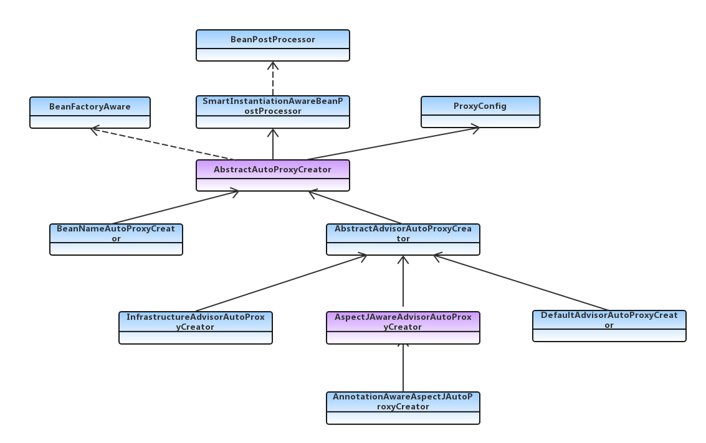

# Spring Aop 多种代理机制相关核心类
[来源博客](https://blog.csdn.net/woshilijiuyi/article/details/83934407)

版权声明：本文为CSDN博主「张书康」的原创文章，遵循 CC 4.0 BY-SA 版权协议，转载请附上原文出处链接及本声明。
原文链接：https://blog.csdn.net/woshilijiuyi/article/details/83934407

核心类，大致分为三类：
advisorCreator，继承 spring ioc的扩展接口 beanPostProcessor，主要用来扫描获取 advisor。
advisor：顾问的意思，封装了spring aop中的切点和通知。
advice：通知，也就是aop中增强的方法。

### advisorCreator 类图

* AbstractAutoProxyCreator：Spring 为Spring AOP 模块暴露的可扩展抽象类，也是 AOP 中最核心的抽象类。Nepxion Matrix 框架便是基于此类对AOP进行扩展和增强。
* BeanNameAutoProxyCreator：根据指定名称创建代理对象（阿里大名鼎鼎的连接池框架druid也基于此类做了扩展）。通过设置 advisor，可以对指定的 beanName 进行代理。支持模糊匹配。
* AbstractAdvisorAutoProxyCreator：功能比较强大，默认扫描所有Advisor的实现类。相对于根据Bean名称匹配，该类更加灵活。动态的匹配每一个类，判断是否可以被代理，并寻找合适的增强类，以及生成代理类。
* DefaultAdvisorAutoProxyCreator：AbstractAdvisorAutoProxyCreator的默认实现类。可以单独使用，在框架中使用AOP，尽量不要手动创建此对象。
* AspectJAwareAdvisorAutoProxyCreator：Aspectj的实现方式，也是Spring Aop中最常用的实现方式，如果用注解方式，则用其子类AnnotationAwareAspectJAutoProxyCreator。
* AnnotationAwareAspectJAutoProxyCreator：目前最常用的AOP使用方式。spring aop 开启注解方式之后，该类会扫描所有@Aspect()注释的类，生成对应的adviosr。目前SpringBoot框架中默认支持的方式，自动配置。
### advisor 类图

* StaticMethodMatcherPointcut：静态方法切面，抽象类。定义了一个classFilter，通过重写getClassFilter()方法来指定切面规则。另外实现了StaticMethodMatcher接口，通过重写matches来指定方法匹配规则。
* StaticMethodMatcherPointcutAdvisor：静态方法匹配切面顾问，同未抽象类，扩展了切面排序方法。
* NameMatchMethodPointcut：名称匹配切面，通过指定方法集合变量mappedNames，模糊匹配。
* NameMatchMethodPointcutAdvisor：方法名称切面顾问，内部封装了
* NameMatchMethodPointcut，通过设置方法名称模糊匹配规则和通知来实现切面功能。
* RegexpMethodPointcutAdvisor：正则表达式切面顾问，可设置多个正则表达式规则，通过内部封装的
* JdkRegexpMethodPointcut 
* DefaultPointcutAdvisor：默认切面顾问，比较灵活。可自由组合切面和通知。
* InstantiationModelAwarePointcutAdvisorImpl：springboot自动装配的顾问类型，也是最常用的一种顾问实现。在注解实现的切面中，所有@Aspect类，都会被解析成该对象。
### advice 类图

* AspectJMethodBeforeAdvice：前置通知，AspectJ中 before 属性对应的通知（@Before标注的方法会被解析成该通知），，在切面方法执行之前执行。
* AspectJAfterReturningAdvice：后置通知，AspectJ中 afterReturning 属性对应的通知（@AfterReturning 标注的方法会被解析成该通知），在切面方法执行之后执行，如果有异常，则不执行。
注意：该通知与AspectJMethodBeforeAdvice对应。
* AspectJAroundAdvice：环绕通知，AspectJ中 around 属性对应的通知（@Around标注的方法会被解析成该通知），在切面方法执行前后执行。
* AspectJAfterAdvice：返回通知，AspectJ中 after 属性对应的通知（@After 标注的方法会被解析成该通知），不论是否异常都会执行。

# 代理
[spring aop代理和aspecj代理的区别](https://www.jianshu.com/p/872d3dbdc2ca)

[Aspectj 在Spring中的使用](https://www.jianshu.com/p/958af6a90477)
## spring aop 代理
Spring 实现动态代理的方 java代理和cglib代理
### 实现类
* 类 AspectJAwareAdvisorAutoProxyCreator
> 用于判断是否代理Bean
  * 方法 postProcessBeforeInstantiation
  * 方法 postProcessAfterInitialization
* 类 AopUtils
> 用于判断是否代理

## AspectJ 代理
### 实现类
* 类 AnnotationAwareAspectJAutoProxyCreator

## AOP切面的坑
* 定义在private方法上的切面不会被执行，这个很容易理解，毕竟子类不能覆盖父类的私有方法。
* 同一个代理子类内部的方法相互调用不会再次执行切面。
这里以Cglib为例对第二点进行说明，cglib的相关核心组件可以参考前面CallbackFilter & Callback部分。对于配置了一个切面的典型场景，Spring内部的执行流程可总结如下图: